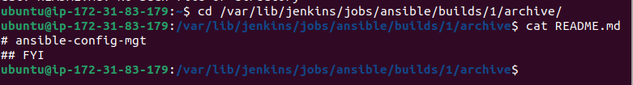

## ANSIBLE CONFIGURATION MANAGEMENT- AUTOMATE PROJECT 7-10

### INTRODUCTION
This project aims to utilize Ansible as a Jump Server. A jump server is a system on a network used to access and manage devices in a separate security zone (wikipedia). A jumper (or a Bastion Host) is an intermediary server via which access to an internal network can be granted. From the current architecture of our recent projects, the webservers would ideally be locatd within a secured network which is directly unreachable via the internet. In such a case, even the DevOps engineers cannot SSh into the webserver instance directly; as it is only accessible via the jump server. This characteristic provides better security for the network and reduces the attack surface.


The diagram above shows target architecture of the network. It conssits of a Virtual Private Network (VPC) which is subdivivded into two (2) subnets:
* Public Subnet with public IP address.

* Private Subnet only reachable via the private IP address.

This project would simulate the use of a **Bastion Host** to access our webservers via the use of Ansible scripts. In order to this, we would need to fulfill the follwing two (2) major tasks:
* Installation and configuration of Ansible client to act as a Jump Server.
* Creating a simple Ansible playbook to automate the server's configuration.

### INSTALLING AND CONFIGURING ANSIBLE  ON EC2 INSTANCE
I updated the name tag on my Jenkins EC2 instance from **Jenkins** to **Jenkins-Ansible**.


Afterwards, I created a new repository in my Github and named it **ansible-config-mgt** 


I updated the jump server instance and installed Ansible and confirmed it was running by checking the Ansible version.


The next phase of the project involved configuring the Jenkins build job to save the repository content every time a change occurs. Firstly I created a new freestyle project called 'ansible' in Jenkins and pointed it to my 'ansible-config-mgt' repository, I added the repository URL to jenkins 


Then I added the payload URL by including /github-webhook/ to the **Jenkins-Ansible's** URL


I also changed the branch specifier from */master to */main and archived the repository for all files by using '**' 


I successfully tested the setup by making a change to README.md in the main branch.


I checked Jenkins saved the files in the required folder by using the command:
```bash
    ls /var/lib/jenkins/jobs/ansible/builds/
```


After verifying that the file has been saved as a built artifact, I checked and verified the edited content of the file.

```bash
    ls /var/lib/jenkins/jobs/ansible/builds/1/archive/
```




The figure below gives a description of the setup after all of these have been completed.


I cloned the git repository for **ansible-config-mgt** 


I created a new branch in the **ansible-config-mgt** named it **prj-11**. Afterwards, I created the  inventory (with common.yml sub-directory) and playbooks directory (with dev.yml, staging.yml, uat.yml and prod.yml subdirectories)   


I created an Ansible inventory file defining the servers to be used for the deployment of the group of hosts belonging to the architecture upon which commands, modules, and tasks in a playbook operate. 
 
Since Ansible uses TCP port 22 by default, thus it can ssh into target servers from **jenkins-ansible** host by implementing the ssh-agent concept by importing the key into **ssh-agent**.
I spinned up 4 RHEL instances (one NFS, 2 webservers and one database server) and one Ubuntu instance (for the Load Balancer User). 

I setup ssh-agen on the Jenkins-Ansible instance 

```bash
    eval `ssh-agent -s`
    ssh-add <private-key>
```
I confirmed the key has been added and I ssh into the Jenkins-Ansible instance using the ssh-agent.
  


I also confirmed that the **jenkins-ansible** instance can ssh into the other instances.


Afterwards, I updated the inventory/dev.yml file with the required code.


Hence, I included the list of hosts in a file on the ansible inventory directory. Afterwards, we need to give ansible instructions on what should be performed on the servers listed in inventory/dev.
For this purpose we need write configuration for repeatable, re-usable and multi-machine tasks which is common to all systems within the infrastructure in the playbooks/common.yml file. 


The code was then pushed to github.


I merged the prj-11 branch with the main branch.


I also checked jenkins and confrimed that the code appeared in the build artefact.


The code change appeared in the main branch and I confirmed that the directories and files appeared on the **jenkins-ansible** instance.


I executed the ansible-playbook command by running the command below while I was in the build directory.
```bash
    ansible-playbook -i inventory/dev.yml playbooks/common.yml
```

I checked the servers to confirm that the latest wireshark has been  installed.


Now the architecture is such that the **jenkins-ansible** server can send commands to all servers in the network to carry out various tasks by adding lines of code to the common.yml file.


To further demonstrate the capability of ansible as a jump server in our current archtecture, I added the task of creating a directory called **test** and a file named **ansible.txt** in all other servers. 
Firstly, I added the new task to the common.yaml file and pushed the file to git. I confirmed that the file has been updated in  Jenkins build artifact. Then I accessed updated common.yaml file in the newly created directory and ran the ansible-playbook command again.


Afterwards, I tested to confirm that the directory and file has been created in the servers.


